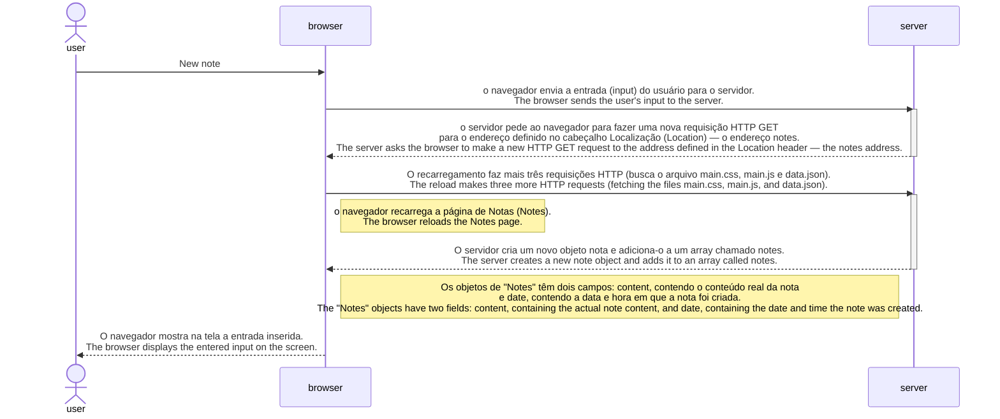

# fullstack_open
Repositório para adicionar os exercícios feitos no curso Fullstack Open   

**0.4 - Novo Diagrama**

```mermaid
sequenceDiagram
    actor user
    participant browser
    participant server

    user->>browser: New note

    browser->>server: o navegador envia a entrada (input) do usuário para o servidor. <br> The browser sends the user's input to the server.
    activate server
    server-->>browser: o servidor pede ao navegador para fazer uma nova requisição HTTP GET <br> para o endereço definido no cabeçalho Localização (Location) — o endereço notes. <br> The server asks the browser to make a new HTTP GET request to the address defined in the Location header — the notes address.
    deactivate server

    browser->>server: O recarregamento faz mais três requisições HTTP (busca o arquivo main.css, main.js e data.json). <br> The reload makes three more HTTP requests (fetching the files main.css, main.js, and data.json).

    activate server

    Note right of browser: o navegador recarrega a página de Notas (Notes). <br> The browser reloads the Notes page.


    server-->>browser: O servidor cria um novo objeto nota e adiciona-o a um array chamado notes. <br> The server creates a new note object and adds it to an array called notes.
    deactivate server

    Note left of server: Os objetos de "Notes" têm dois campos: content, contendo o conteúdo real da nota <br> e date, contendo a data e hora em que a nota foi criada. <br> The "Notes" objects have two fields: content, containing the actual note content, and date, containing the date and time the note was created.

    browser-->>user: O navegador mostra na tela a entrada inserida. <br> The browser displays the entered input on the screen.

```
